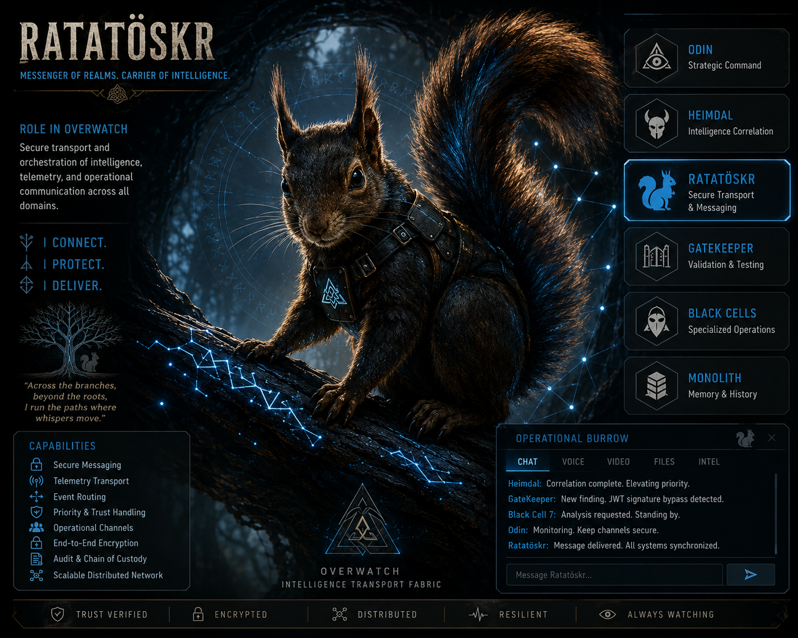

# OVERWATCH Ratatoskr

## Transport. Connect. Deliver.

  

Ratatoskr is the secure intelligence transport subsystem of the OVERWATCH cybersecurity ecosystem.

Inspired by the messenger squirrel of Norse mythology, Ratatoskr is responsible for moving intelligence between OVERWATCH components while maintaining delivery visibility, message tracking, and operational reliability.

---

## Core Functions

- Message Creation
- Message Routing
- Delivery Tracking
- Automatic Message ID Generation
- Delivery History Logging
- Future Message Integrity Validation
- Future Secure Inter-System Communication